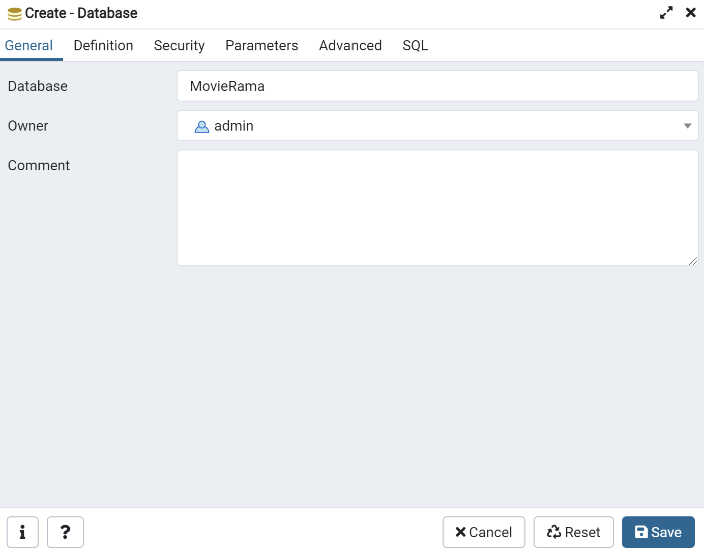

# Installing

## Database setup


1. Download and install [PostgreSQL](https://www.enterprisedb.com/downloads/postgres-postgresql-downloads)
 version 13.4


2. Open pgAdmin and create a `Login/Group role` with `Name: admin` , `Password: admin` and privileges as seen in the image


3. Create a Database with `Name : MovieRama` and `Owner: admin` which represents the user we just created




## Project setup

1. Clone the repo 

```
git clone https://github.com/harteros/MovieRama.git
```

2. Open the project folder and install all the requirements

```
pip install -r requirements.txt
```
3. Inside the project folder run the following command

```
python manage.py migrate
```